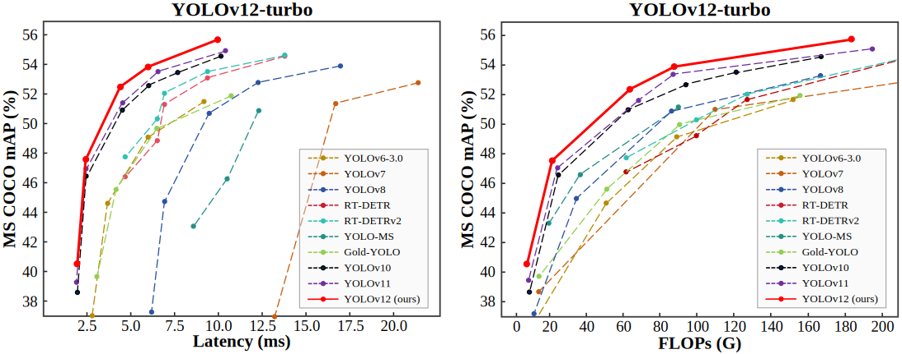

<div align="center">
<h1>YOLOv12</h1>
<h3>YOLOv12: Attention-Centric Real-Time Object Detectors</h3>
<h3>YOLOv12：以注意力机制为中心的实时目标检测器</h3>

[Yunjie Tian](https://sunsmarterjie.github.io/)<sup>1</sup>, [Qixiang Ye](https://people.ucas.ac.cn/~qxye?language=en)<sup>2</sup>, [David Doermann](https://cse.buffalo.edu/~doermann/)<sup>1</sup>

<sup>1</sup>  University at Buffalo, SUNY, <sup>2</sup> University of Chinese Academy of Sciences.
<sup>1</sup>  布法罗大学，纽约州立大学, <sup>2</sup> 中国科学院大学.


<p align="center">
   <br>
  Comparison with popular methods in terms of latency-accuracy (left) and FLOPs-accuracy (right) trade-offs
  <br>与流行方法在延迟-精度（左）和计算量-精度（右）权衡方面的比较
</p>

</div>

[](https://arxiv.org/abs/2502.12524) [](https://huggingface.co/spaces/sunsmarterjieleaf/yolov12) <a href="https://colab.research.google.com/github/roboflow-ai/notebooks/blob/main/notebooks/train-yolov12-object-detection-model.ipynb"></a> [](https://www.kaggle.com/code/jxxn03x/yolov12-on-custom-data) [](https://blog.roboflow.com/use-yolov12-with-roboflow/#deploy-yolov12-models-with-roboflow) [](https://openbayes.com/console/public/tutorials/A4ac4xNrUCQ) 

## Updates
## 更新

- 2025/03/18: Some guys are interested in the heatmap. See this [issue](https://github.com/sunsmarterjie/yolov12/issues/74).
- 2025/03/18: 有些人对热图感兴趣。请查看此[问题](https://github.com/sunsmarterjie/yolov12/issues/74)。

- 2025/03/09: **YOLOv12-turbo** is released: a faster YOLOv12 version.
- 2025/03/09: **YOLOv12-turbo** 版本发布：一个更快的YOLOv12版本。

- 2025/02/24: Blogs: [ultralytics](https://docs.ultralytics.com/models/yolo12/), [LearnOpenCV](https://learnopencv.com/yolov12/). Thanks to them!
- 2025/02/24: 博客：[ultralytics](https://docs.ultralytics.com/models/yolo12/), [LearnOpenCV](https://learnopencv.com/yolov12/)。感谢他们！

- 2025/02/22: [YOLOv12 TensorRT CPP Inference Repo + Google Colab Notebook](https://github.com/mohamedsamirx/YOLOv12-TensorRT-CPP).
- 2025/02/22: [YOLOv12 TensorRT C++推理仓库 + Google Colab笔记本](https://github.com/mohamedsamirx/YOLOv12-TensorRT-CPP)。

- 2025/02/22: [Android deploy](https://github.com/mpj1234/ncnn-yolov12-android/tree/main) / [TensorRT-YOLO](https://github.com/laugh12321/TensorRT-YOLO) accelerates yolo12. Thanks to them!
- 2025/02/22: [Android部署](https://github.com/mpj1234/ncnn-yolov12-android/tree/main) / [TensorRT-YOLO](https://github.com/laugh12321/TensorRT-YOLO)加速yolo12。感谢他们！

- 2025/02/21: Try yolo12 for classification, oriented bounding boxes, pose estimation, and instance segmentation at [ultralytics](https://github.com/ultralytics/ultralytics/tree/main/ultralytics/cfg/models/12). Please pay attention to this [issue](https://github.com/sunsmarterjie/yolov12/issues/29). Thanks to them! 
- 2025/02/21: 在[ultralytics](https://github.com/ultralytics/ultralytics/tree/main/ultralytics/cfg/models/12)尝试使用yolo12进行分类、定向边界框、姿态估计和实例分割。请注意这个[问题](https://github.com/sunsmarterjie/yolov12/issues/29)。感谢他们！

- 2025/02/20: [Any computer or edge device?](https://github.com/roboflow/inference)  / [ONNX CPP Version](https://github.com/mohamedsamirx/YOLOv12-ONNX-CPP). Thanks to them! 
- 2025/02/20: [任何计算机或边缘设备？](https://github.com/roboflow/inference) / [ONNX C++版本](https://github.com/mohamedsamirx/YOLOv12-ONNX-CPP)。感谢他们！
  
- 2025/02/20: Train a yolov12 model on a custom dataset: [Blog](https://blog.roboflow.com/train-yolov12-model/) and [Youtube](https://www.youtube.com/watch?v=fksJmIMIfXo). / [Step-by-step instruction](https://youtu.be/dO8k5rgXG0M). Thanks to them! 
- 2025/02/20: 在自定义数据集上训练yolov12模型：[博客](https://blog.roboflow.com/train-yolov12-model/)和[Youtube](https://www.youtube.com/watch?v=fksJmIMIfXo)。/ [步骤指导](https://youtu.be/dO8k5rgXG0M)。感谢他们！

- 2025/02/19: [arXiv version](https://arxiv.org/abs/2502.12524) is public. [Demo](https://huggingface.co/spaces/sunsmarterjieleaf/yolov12) is available (try [Demo2](https://huggingface.co/spaces/sunsmarterjieleaf/yolov12_demo2) [Demo3](https://huggingface.co/spaces/sunsmarterjieleaf/yolov12_demo3) if busy).
- 2025/02/19: [arXiv版本](https://arxiv.org/abs/2502.12524)已公开。[演示](https://huggingface.co/spaces/sunsmarterjieleaf/yolov12)可用（如果繁忙，请尝试[演示2](https://huggingface.co/spaces/sunsmarterjieleaf/yolov12_demo2) [演示3](https://huggingface.co/spaces/sunsmarterjieleaf/yolov12_demo3)）。


<details>
  <summary>
  <font size="+1">Abstract</font>
  <font size="+1">摘要</font>
  </summary>
Enhancing the network architecture of the YOLO framework has been crucial for a long time but has focused on CNN-based improvements despite the proven superiority of attention mechanisms in modeling capabilities. This is because attention-based models cannot match the speed of CNN-based models. This paper proposes an attention-centric YOLO framework, namely YOLOv12, that matches the speed of previous CNN-based ones while harnessing the performance benefits of attention mechanisms.

增强YOLO框架的网络架构长期以来一直至关重要，但主要集中在基于CNN的改进上，尽管注意力机制在建模能力方面已被证明更为优越。这是因为基于注意力的模型无法匹配基于CNN的模型的速度。本文提出了一个以注意力为中心的YOLO框架，即YOLOv12，它能够匹配之前基于CNN的框架的速度，同时利用注意力机制的性能优势。

YOLOv12 surpasses all popular real-time object detectors in accuracy with competitive speed. For example, YOLOv12-N achieves 40.6% mAP with an inference latency of 1.64 ms on a T4 GPU, outperforming advanced YOLOv10-N / YOLOv11-N by 2.1%/1.2% mAP with a comparable speed. This advantage extends to other model scales. YOLOv12 also surpasses end-to-end real-time detectors that improve DETR, such as RT-DETR / RT-DETRv2: YOLOv12-S beats RT-DETR-R18 / RT-DETRv2-R18 while running 42% faster, using only 36% of the computation and 45% of the parameters.

YOLOv12在精度上超越了所有流行的实时目标检测器，同时保持竞争力的速度。例如，YOLOv12-N在T4 GPU上达到40.6%的mAP，推理延迟为1.64 ms，以相当的速度超过高级YOLOv10-N / YOLOv11-N 2.1%/1.2%的mAP。这种优势扩展到其他模型规模。YOLOv12还超越了改进DETR的端到端实时检测器，如RT-DETR / RT-DETRv2：YOLOv12-S击败RT-DETR-R18 / RT-DETRv2-R18，同时运行速度快42%，仅使用36%的计算量和45%的参数。
</details>


## Main Results
## 主要结果

**Turbo (default version)**:
**Turbo（默认版本）**:
| Model                                                                                | size<br><sup>(pixels) | mAP<sup>val<br>50-95 | Speed<br><sup>T4 TensorRT10<br> | params<br><sup>(M) | FLOPs<br><sup>(G) |
| 模型                                                                                 | 尺寸<br><sup>(像素)   | mAP<sup>验证<br>50-95 | 速度<br><sup>T4 TensorRT10<br> | 参数量<br><sup>(M) | 计算量<br><sup>(G) |
| :----------------------------------------------------------------------------------- | :-------------------: | :-------------------:| :------------------------------:| :-----------------:| :---------------:|
| [YOLO12n](https://github.com/sunsmarterjie/yolov12/releases/download/turbo/yolov12n.pt) | 640                   | 40.4                 | 1.60                            | 2.5                | 6.0               |
| [YOLO12s](https://github.com/sunsmarterjie/yolov12/releases/download/turbo/yolov12s.pt) | 640                   | 47.6                 | 2.42                            | 9.1                | 19.4              |
| [YOLO12m](https://github.com/sunsmarterjie/yolov12/releases/download/turbo/yolov12m.pt) | 640                   | 52.5                 | 4.27                            | 19.6               | 59.8              |
| [YOLO12l](https://github.com/sunsmarterjie/yolov12/releases/download/turbo/yolov12l.pt) | 640                   | 53.8                 | 5.83                            | 26.5               | 82.4              |
| [YOLO12x](https://github.com/sunsmarterjie/yolov12/releases/download/turbo/yolov12x.pt) | 640                   | 55.4                 | 10.38                           | 59.3               | 184.6             |

[**v1.0**](https://github.com/sunsmarterjie/yolov12/tree/V1.0):
[**v1.0版本**](https://github.com/sunsmarterjie/yolov12/tree/V1.0):
| Model                                                                                | size<br><sup>(pixels) | mAP<sup>val<br>50-95 | Speed<br><sup>T4 TensorRT10<br> | params<br><sup>(M) | FLOPs<br><sup>(G) |
| 模型                                                                                 | 尺寸<br><sup>(像素)   | mAP<sup>验证<br>50-95 | 速度<br><sup>T4 TensorRT10<br> | 参数量<br><sup>(M) | 计算量<br><sup>(G) |
| :----------------------------------------------------------------------------------- | :-------------------: | :-------------------:| :------------------------------:| :-----------------:| :---------------:|
| [YOLO12n](https://github.com/sunsmarterjie/yolov12/releases/download/v1.0/yolov12n.pt) | 640                   | 40.6                 | 1.64                            | 2.6                | 6.5               |
| [YOLO12s](https://github.com/sunsmarterjie/yolov12/releases/download/v1.0/yolov12s.pt) | 640                   | 48.0                 | 2.61                            | 9.3                | 21.4              |
| [YOLO12m](https://github.com/sunsmarterjie/yolov12/releases/download/v1.0/yolov12m.pt) | 640                   | 52.5                 | 4.86                            | 20.2               | 67.5              |
| [YOLO12l](https://github.com/sunsmarterjie/yolov12/releases/download/v1.0/yolov12l.pt) | 640                   | 53.7                 | 6.77                            | 26.4               | 88.9              |
| [YOLO12x](https://github.com/sunsmarterjie/yolov12/releases/download/v1.0/yolov12x.pt) | 640                   | 55.2                 | 11.79                           | 59.1               | 199.0             |

## Installation
## 安装
```
wget https://github.com/Dao-AILab/flash-attention/releases/download/v2.7.3/flash_attn-2.7.3+cu11torch2.2cxx11abiFALSE-cp311-cp311-linux_x86_64.whl
conda create -n yolov12 python=3.11
conda activate yolov12
pip install -r requirements.txt
pip install -e .
```

## Validation
## 验证
[`yolov12n`](https://github.com/sunsmarterjie/yolov12/releases/download/turbo/yolov12n.pt)
[`yolov12s`](https://github.com/sunsmarterjie/yolov12/releases/download/turbo/yolov12s.pt)
[`yolov12m`](https://github.com/sunsmarterjie/yolov12/releases/download/turbo/yolov12m.pt)
[`yolov12l`](https://github.com/sunsmarterjie/yolov12/releases/download/turbo/yolov12l.pt)
[`yolov12x`](https://github.com/sunsmarterjie/yolov12/releases/download/turbo/yolov12x.pt)

```python
from ultralytics import YOLO

model = YOLO('yolov12{n/s/m/l/x}.pt')
model.val(data='coco.yaml', save_json=True)
```

## Training 
## 训练
```python
from ultralytics import YOLO

model = YOLO('yolov12n.yaml')

# Train the model
# 训练模型
results = model.train(
  data='coco.yaml',
  epochs=600, 
  batch=256, 
  imgsz=640,
  scale=0.5,  # S:0.9; M:0.9; L:0.9; X:0.9
  mosaic=1.0,
  mixup=0.0,  # S:0.05; M:0.15; L:0.15; X:0.2
  copy_paste=0.1,  # S:0.15; M:0.4; L:0.5; X:0.6
  device="0,1,2,3",
)

# Evaluate model performance on the validation set
# 评估模型在验证集上的性能
metrics = model.val()

# Perform object detection on an image
# 在图像上执行目标检测
results = model("path/to/image.jpg")
results[0].show()

```

## Prediction
## 预测
```python
from ultralytics import YOLO

model = YOLO('yolov12{n/s/m/l/x}.pt')
model.predict()
```

## Export
## 导出
```python
from ultralytics import YOLO

model = YOLO('yolov12{n/s/m/l/x}.pt')
model.export(format="engine", half=True)  # or format="onnx"  # 或格式="onnx"
```


## Demo
## 演示

```
python app.py
# Please visit http://127.0.0.1:7860
# 请访问 http://127.0.0.1:7860
```


## Acknowledgement
## 致谢

The code is based on [ultralytics](https://github.com/ultralytics/ultralytics). Thanks for their excellent work!
代码基于[ultralytics](https://github.com/ultralytics/ultralytics)。感谢他们的杰出工作！

## Citation
## 引用

```BibTeX
@article{tian2025yolov12,
  title={YOLOv12: Attention-Centric Real-Time Object Detectors},
  author={Tian, Yunjie and Ye, Qixiang and Doermann, David},
  journal={arXiv preprint arXiv:2502.12524},
  year={2025}
}
```

